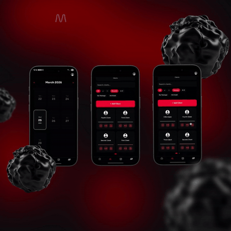

# 🏋️ GATE — Private Gym Management App

A cross-platform **iOS & Android** app for a private gym and personal trainers. Trainers manage their clients, schedule sessions on a calendar, track attendance, and log workouts set-by-set; clients get their schedule and training history in their pocket. Built with React Native (Expo) and a Firebase backend, shipped to both stores.



---

## ✨ Features

- **Cross-platform** — one codebase runs as a native **iOS** and **Android** app (available on the App Store and Google Play).
- **Client management** — trainers see all their clients, search, sort, filter (by package, archived, etc.), and add new ones.
- **Session scheduling** — a daily **calendar** of sessions with time slots and client names.
- **Attendance tracking** — mark each session **Attended** or **No-show**.
- **Workout logging** — add exercises to a session and record **sets, reps, and weight** (e.g. "Barbell Bench Press — Set 1: 10 reps × 100 kg").
- **Trainer invites** — invite-only onboarding for trainers via generated invite links.
- **Push notifications** — reminders and updates delivered even when the app is closed (Firebase Cloud Messaging).
- **Real-time data** — schedules and clients stay in sync via Firestore.
- **Privacy-aware sessions** — support for private/gender-specific session handling.

## 🧱 Tech Stack

| Layer | Technology |
|---|---|
| **Framework** | React Native + **Expo** (TypeScript) |
| **Routing** | expo-router (file-based) |
| **Database** | Firebase **Firestore** (real-time) |
| **Backend logic** | Firebase **Cloud Functions** |
| **Notifications** | Firebase Cloud Messaging + a small push server |
| **Builds** | EAS (Expo Application Services), separate **dev / prod** environments |

## 🚀 Getting Started

```bash
# 1. Install dependencies
npm install

# 2. Add your Firebase config
#    (google-services.json / GoogleService-Info.plist and env files)

# 3. Start the Expo dev server
npx expo start
```

Open in the **Expo Go** app, an Android emulator, or an iOS simulator.

## 🏗️ Architecture

- **App (`app/`, `src/`)** — the React Native UI, file-based routes for trainer/client flows.
- **Firebase** — Firestore holds trainers, clients, sessions, and bookings; Cloud Functions (`functions/`) handle server-side logic like invites.
- **Push server (`push-server/`)** — sends notifications through FCM.
- **Environments** — `.env.dev` / `.env.prod` and separate Firebase projects keep development and production isolated.

## 📁 Project Structure

```
Gate/
├── app/            # Screens (expo-router)
├── src/            # Components & logic
├── functions/      # Firebase Cloud Functions
├── push-server/    # Push notification server
├── firestore-migrate/  # Data migration scripts
├── assets/         # Images & icons
└── docs/           # Screenshots
```

## 📝 Notes

- Firebase config and Expo tokens should be provided via environment/config files and kept out of version control.

---

_Built by [Maher Lawand](https://github.com/MaherLawand)._
